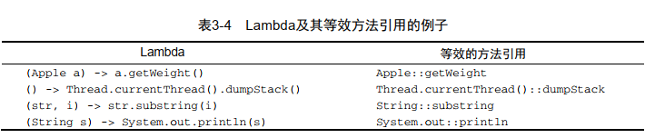
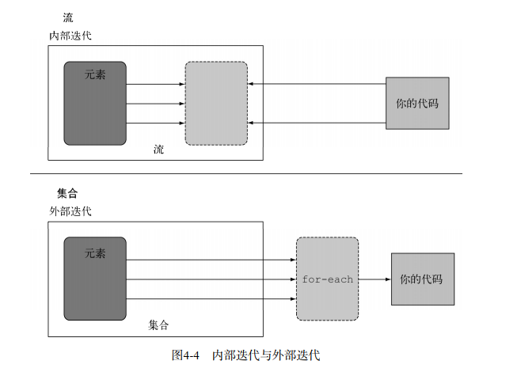

# java8

### 参数化代码
- 因为需求的不断变化，我们需要代码参数化
    - 传统方法使用策略模式，参数定义为接口，然后传递的是接口的不同实现。
    这样在查看代码的时候避免了多参数带来的方法语义不明确，缺点是代码被包裹在
    对象里面传递，属于“内联传递代码”，旨在使用同一个方法给他不同的行为达到不同的目的
    
### lambda
- 可以使用lambda简化以上代码
    - lambda前提条件函数式接口定义值定义一个抽象方法
    - java.util.function包中引入了几个新的函数式接口
        - 典型代表Predicate、 Consumer和Function
        
    - 专门为某些类设计的函数式接口
        - 废除自动装箱
```java
public interface IntPredicate{
boolean test(int t);
}
IntPredicate evenNumbers = (int i) -> i % 2 == 0;
evenNumbers.test(1000);  //true
Predicate<Integer> oddNumbers = (Integer i) -> i % 2 == 1;
oddNumbers.test(1000);  //false
```

- 针对专门的输入参数类型的函数式接口的名称都要加上对应的原始类型前缀，比
  如DoublePredicate、 IntConsumer、 LongBinaryOperator、 IntFunction等。 Function
  接口还有针对输出参数类型的变种： ToIntFunction<T>、 IntToDoubleFunction等。

- 任何函数式接口都不允许抛出受检异常（ checked exception）。如果你需要Lambda
  表达式来抛出异常， 有两种办法： 定义一个自己的函数式接口，并声明受检异常，或者把Lambda
  包在一个try/catch块中
  
#### 类型检查
  
- 我们通过代码的语义（赋值、参数上下文）来知道lambda的实现的是哪个函数式接口（目标类型）
```java
Runnable r = () -> {System.out.println("Tricky example"); };
```
-  自动寻找上下文：Java编译器会从上下文（目标类型）推断出用什么函数式接
  口来配合Lambda表达式，这意味着它也可以推断出适合Lambda的签名

```java
Comparator<Apple> c =
(Apple a1, Apple a2) -> a1.getWeight().compareTo(a2.getWeight());
Comparator<Apple> c =
(a1, a2) -> a1.getWeight().compareTo(a2.getWeight()); //编译器根据上下文自己推断类型
```

#### 闭包
- 闭包：闭包可以作为参数传递给另一个函数。它也可以访
     问和修改其作用域之外的变量。现在， Java 8的Lambda和匿名类可以做类似于闭包的事情：
     它们可以作为参数传递给方法，并且可以访问其作用域之外的变量
```java
//lambda只能访问闭包函数外的局部变量，不能修改
        int a = 2;
        Runnable runnable = () -> {
          // a - 1;   变异不通过
            System.out.println(a);
        };
```

#### 方法引用

- 方法引用就是让你根据已有的方法实现来创建
  Lambda表达式

- Apple::getWeight就是引用了Apple类中定义的方法getWeight

- 比较器链

- 方法引用和lambda的转化图：

```java
inventory.sort(comparing(Apple::getWeight)
.reversed()                             //按重量递降
.thenComparing(Apple::getCountry));    //如果重量相同就比较国际
```

### 流

#### 流是什么

- 通过申明式处理集合，而不是通过逻辑处理集合元素，有点类似于sql

- 开发者对并行透明（避免了自己处理多线程）
```java
List<String> lowCaloricDishesName =
menu.parallelStream()
.filter(d -> d.getCalories() < 400)
.sorted(comparing(Dishes::getCalories))
.map(Dish::getName)
.collect(toList());
```

- 以上代码从语义上分析表示想要完成什么，而不是进行逻辑判断操作什么


#### 流和集合

- 流和集合的不同：流的目的在于表达计算，比如你前面见到的
          filter、 sorted和map。集合讲的是数据，流讲的是计算
          简单的说集合是数据的存储，流是数据的操作
- 使用流的条件：
    - 源：数据源（集合、数组）等用于给流操作
    - 数据操作：对源的map、sort等操作
    - 流水线：
    - 内部迭代：流的迭代操作是在背后进行的 
    - cascas撒擦 
#### 流操作

-  一个数据源（如集合）来执行一个查询；
-  一个中间操作链，形成一条流的流水线；中间操作返回流
- 一个终端操作，执行流水线，并能生成结果；返回任意不是流的值

- 筛选
    - 谓词筛选：筛选一个返回值为boolean的函数，返回一个所有符合这个函数的流
    - distinct筛选：通过（hashcode 和 equal）让元素互不相同
    - limit筛选
    - skip筛选
- 映射
    - map 映射和flat映射：
        - 当map映射把每个集合元素处理后的的到一个流，这个流里面包含的是数组
        可以用flatMap把这个流里面的数组变成一小段一小段的流，然后再把这些流链接起来，
        这叫扁平化流

- 查找

-  java.util.Optional
    - 是一个容器类代表一个值存在不存在
    - findAny 返回值